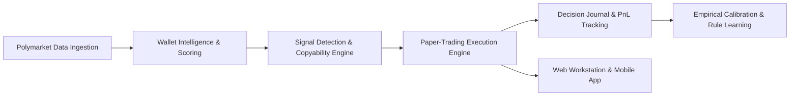

# BOTS

**BOTS** is a deterministic copy-trading research, market intelligence, and automated paper-trading platform designed for Polymarket prediction markets. It continuously discovers high-conviction traders, evaluates copyability conditions, generates simulated trade decisions, and provides real-time monitoring across a modern web workstation and a native Android application.

---

## Core Concepts

- **Polymarket Copy-Trading**: Identifies market leaders and tracks their trade activity in near real-time to analyze alpha generation, timing, and execution conditions.
- **Wallet & Signal Intelligence**: Evaluates trader performance across consistency, volume, one-hit wonder concentration, latency, and category edge (e.g., Politics, Economics, Pop Culture) with verifiable provenance.
- **Automated Paper Trading**: Simulates order execution against point-in-time orderbook snapshots, modeling real-world spread, market depth, execution delay, and slippage.
- **Empirical Calibration**: Backtests historical trade setups across customizable time horizons to calculate modeled copy PnL vs. actual trader PnL.
- **Controlled Rule Learning**: Autonomous parameter adaptation using strict walk-forward validation and hard safety guardrails to continuously optimize scoring thresholds.
- **Web Workstation**: High-density operator dashboard built with React and Vite featuring a Turquoise Harmony visual theme, top horizontal category navigation, and live telemetry.
- **Android Application**: Native Jetpack Compose mobile app providing 24/7 telemetry monitoring, signal feeds, paper trade positions, and engine lifecycle management.

---

## How It Works



1. **Data Ingestion**: Polls public leaderboard rankings, wallet transaction activities, and CLOB orderbook states without API keys.
2. **Scoring & Copyability**: Rates wallet consistency and validates that the market spread, top-of-book depth, and latency meet copyability constraints.
3. **Paper Execution**: Opens simulated positions strictly bounded between \$5.00 and \$20.00, tracking unrealized and realized PnL against market resolutions.
4. **Calibration & Learning**: Proposes candidate rule parameters, validates them on out-of-sample datasets, and promotes only mathematically proven improvements.

---

## Getting Started

### Prerequisites

- **Node.js**: `v20.0.0+` (Built-in `node:sqlite` supported)
- **npm**: `v9.0.0+`
- **Android SDK & JDK 17+** (for Android build)

### Installation

```bash
# Clone repository
git clone https://github.com/F3AR4/bots.git
cd bots

# Install dependencies
npm install
```

### Running Tests & Builds

```bash
# Run complete test suite (22 suites, 190 tests)
npm test

# Build the Web Workstation client bundle
npm run build:client

# Type-check backend and client
npm run typecheck
npm run typecheck:client
```

### Running the System

```bash
# Start Web Server & API (port 3000)
npm run web

# Start Background Paper-Trading Daemon
npm run bot:start

# Inspect Daemon Status & Telemetry
npm run bot:status

# Stop Background Daemon
npm run bot:stop
```

### Calibration & Rule Learning CLI

```bash
# Run empirical calibration across historical observations
npm run calibrate

# Generate calibration summary report
npm run calibrate:report

# Inspect candidate rule proposals and active RuleSet history
npm run rules:candidates
npm run rules:history
```

---

## Important Safety Boundary

> [!IMPORTANT]
> **Strict Paper-Trading Only**
> - **Zero Real-Money Execution**: BOTS is strictly a research and simulation system.
> - **No Private Keys**: The codebase contains zero private key ingestion, wallet signing primitives, or exchange order submission logic.
> - **Bounded Sizing**: Simulated trade sizing is strictly bounded between **\$5.00 min** and **\$20.00 max**.
> - **Fail-Closed Safety**: Any attempt to execute non-paper orders or supply credentials triggers an immediate hard runtime safety abort.

---

## Android APK

The native Android companion app is built with Kotlin and Jetpack Compose for remote monitoring and paper-trading observability.

Download the latest pre-compiled APK directly from the GitHub Release:
👉 **[Download BOTS Android APK (v1.0.0)](https://github.com/F3AR4/bots/releases/tag/v1.0.0)**

---

## License

This project is licensed under the MIT License — see the [LICENSE](LICENSE) file for details.
